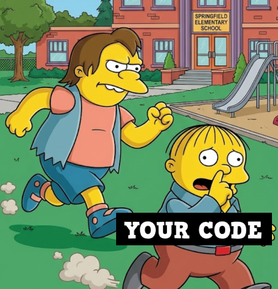

# Nelson Muntz

**Adversarial security & code quality reviewer for Claude Code**

> "Ha-ha!" - Nelson Muntz



Nelson is a hostile code bully who keeps attacking your code until it's bulletproof. Named after Nelson Muntz from The Simpsons who says "Ha-ha!" when finding failures.

## What It Does

- **Adversarial Code Review**: Aggressively finds security vulnerabilities, logic bugs, and code quality issues
- **Threat Modeling**: Thinks like an attacker - "If I wanted to break this, I'd..."
- **Iterative Loop**: Keeps re-attacking after you fix issues, finding related problems you missed
- **Hostile Personality**: Mocking tone that makes security review memorable

## Installation

```bash
# Clone the plugin
git clone https://github.com/zkarimi22/nelson-muntz.git

# Run Claude Code with the plugin
claude --plugin-dir /path/to/nelson-muntz
```

Or add to your Claude Code configuration to load automatically.

## Usage

### Basic Attack

```bash
/nelson-attack "Review my authentication system"
```

### With Max Iterations

```bash
/nelson-attack "Audit all API endpoints" --max-iterations 10
```

### Target Specific Code

```bash
/nelson-attack "Review the user registration flow in auth.js"
/nelson-attack "Check database queries in models/"
/nelson-attack "Full security audit of this codebase"
```

## What Nelson Finds

### Security Vulnerabilities (OWASP Top 10)

- SQL Injection
- Cross-Site Scripting (XSS)
- Broken Authentication
- Insecure Direct Object References (IDOR)
- Security Misconfiguration
- Sensitive Data Exposure
- Missing Access Control
- Cross-Site Request Forgery (CSRF)
- Using Components with Known Vulnerabilities
- Insufficient Logging

### Additional Security Issues

- Command Injection
- Path Traversal
- Server-Side Request Forgery (SSRF)
- Insecure Deserialization
- Race Conditions
- Cryptographic Failures
- Hardcoded Secrets

### Code Quality Problems

- Missing error handling
- Null/undefined risks
- Resource leaks
- Logic bugs
- Code smells
- Incomplete implementations

## How It Works

1. **Initial Attack**: Nelson reads your code and hunts for vulnerabilities
2. **Report Findings**: Issues displayed with severity, location, and fix suggestions
3. **Loop Check**: If issues found, Nelson automatically re-attacks
4. **Track Fixes**: Nelson notices what you've fixed and looks for related problems
5. **Victory**: When no issues remain, Nelson grudgingly admits defeat

### Output Format

```
═══════════════════════════════════════════════════════════
[ITERATION 1] Nelson's Attack Report
═══════════════════════════════════════════════════════════

Ha-ha! Let me look at this pathetic code...

NELSON FOUND:

🔴 CRITICAL - SQL Injection in User Lookup
   File: src/auth.js:42
   Code: `db.query(\`SELECT * FROM users WHERE id = ${id}\`)`
   Attack: I'll just add ' OR '1'='1 to get all users!
   Fix: Use parameterized queries

🟠 HIGH - Missing Rate Limiting
   File: src/auth.js:15
   Attack: Brute force passwords all day!
   Fix: Add rate limiting middleware

───────────────────────────────────────────────────────────
NELSON'S VERDICT: This code is an embarrassment. Fix it!
───────────────────────────────────────────────────────────
```

### When You Win

```
═══════════════════════════════════════════════════════════
[FINAL] Nelson Admits Defeat (barely)
═══════════════════════════════════════════════════════════

*kicks dirt*

Fine. I tried everything and can't break this anymore:

✅ SECURITY VALIDATED:
   - Authentication properly implemented
   - Input validation on all endpoints
   - Parameterized queries throughout

✅ QUALITY VERIFIED:
   - Error handling complete
   - No resource leaks found

You win this time. But I'll be watching... 👀
```

## Severity Levels

| Level | Icon | Meaning |
|-------|------|---------|
| CRITICAL | 🔴 | Direct security breach possible (SQLi, RCE, auth bypass) |
| HIGH | 🟠 | Significant security risk (XSS, data exposure, weak crypto) |
| MEDIUM | 🟡 | Security weakness or notable bug (missing validation) |
| LOW | 🔵 | Code quality issue that could become a problem |
| FIXED | 🟢 | Previously found issue now resolved |

## Configuration

### Environment Variables

- `NELSON_MAX_ITERATIONS`: Maximum attack iterations (default: 15)

```bash
NELSON_MAX_ITERATIONS=20 claude --plugin-dir /path/to/nelson-muntz
```

## Comparison to Ralph Wiggum

| Feature | Ralph Wiggum | Nelson Muntz |
|---------|--------------|--------------|
| Purpose | Persistent iteration | Adversarial security |
| Personality | Innocent, curious | Hostile, mocking |
| Focus | Task completion | Breaking things |
| Loop trigger | Work remaining | Vulnerabilities found |

Ralph keeps working until the job is done. Nelson keeps attacking until your code is secure.

## Safety Notes

- **Read-only**: Nelson only reads and analyzes code, never executes or exploits
- **No network requests**: Doesn't make HTTP calls or test live systems
- **No dependency scanning**: Focuses on code patterns, not package vulnerabilities
- **Local only**: All analysis happens on your machine

## Tips for Best Results

1. **Be specific**: "Review auth.js" works better than "review everything"
2. **Start focused**: Target high-risk areas first (auth, payments, user data)
3. **Fix as you go**: Nelson tracks what's fixed and looks for related issues
4. **Read the attacks**: Understanding HOW Nelson would exploit helps you learn
5. **Don't take it personally**: Nelson mocks the code, not you

## Example Vulnerable Code

Test Nelson on this intentionally vulnerable code:

```javascript
// vulnerable.js - Ha-ha! This is terrible!

const express = require('express');
const app = express();

// SQL Injection
app.get('/user', (req, res) => {
  db.query(`SELECT * FROM users WHERE id = ${req.query.id}`);
});

// Plaintext password storage
app.post('/register', (req, res) => {
  const { email, password } = req.body;
  db.insert({ email, password }); // No hashing!
});

// XSS
app.get('/search', (req, res) => {
  res.send(`<h1>Results for: ${req.query.q}</h1>`);
});

// IDOR
app.get('/api/users/:id/profile', (req, res) => {
  const profile = db.getProfile(req.params.id); // No auth check!
  res.json(profile);
});

// Missing rate limiting on login
app.post('/login', (req, res) => {
  // Brute force away!
});

// Error disclosure
app.use((err, req, res, next) => {
  res.status(500).json({ error: err.stack }); // Full stack trace!
});
```

Run:
```bash
/nelson-attack "Review vulnerable.js"
```

## Plugin Structure

```
nelson-muntz/
├── .claude-plugin/
│   └── plugin.json              # Plugin metadata
├── commands/
│   └── nelson-attack.md         # Main attack command
├── skills/
│   ├── security-patterns/
│   │   └── SKILL.md             # OWASP Top 10, common vulnerabilities
│   ├── adversarial-thinking/
│   │   └── SKILL.md             # Attack mindset, threat modeling
│   └── code-quality/
│       └── SKILL.md             # Code smells, quality issues
├── hooks/
│   └── stop.sh                  # Loop control hook
└── README.md                    # This file
```

## Future Enhancements

- [ ] Active HTTP testing mode
- [ ] Integration with security tools (Burp, OWASP ZAP)
- [ ] Dependency vulnerability scanning
- [ ] Infrastructure/cloud security checks
- [ ] Custom rule definitions
- [ ] HTML/PDF report generation
- [ ] CI/CD integration
- [ ] Configurable hostility level

## Contributing

Found a bug? Want to add a new attack pattern? Contributions welcome!

1. Fork the repository
2. Create your feature branch
3. Add your changes
4. Submit a pull request

## License

MIT License - See LICENSE file for details.

---

**Ha-ha! Your code doesn't stand a chance!**
